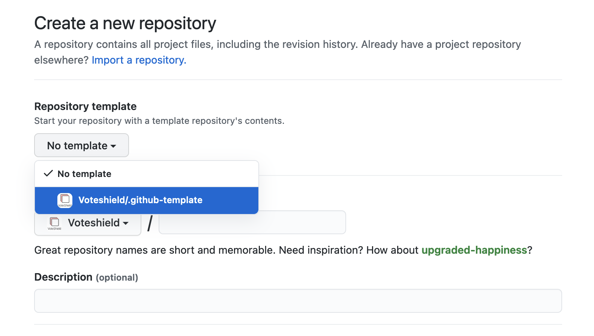

# Github template

This is a basic repo that can be used as a template for new projects, or simply use these parts in your projects as needed.

## Using this template

When creating a new repo, you can use this as a template.

## Conventions

- Update this README.
- Update the `.gitignore` with the appropriate language [Github gitignore](https://github.com/github/gitignore).
- Fill-in the `docs/CONTRIBUTING.md` with specifics on how to contribute to this project.
- Utilize separate markdown files in the `docs/` directory for documentation.
  - Note that certain files, Github will recognize and enhance the Github UI project with, such as CONTRIBUTING.md.
- Utilize a `src/` directory for code unless it doesn't make sense for your project.

**============= _Remove text above and including here_ =================**

# [Project name]

[Top-level description of the project, it's purpose, basics on how it works, and why it is needed.]

## Usage

[Describe how to use this project in detail.]

## Contributing

See [docs/CONTRIBUTING.md](./docs/CONTRIBUTING.md).

## License

Licensed under the [LGPL 3.0](https://www.gnu.org/licenses/lgpl-3.0.en.html); see [LICENSE.txt](./LICENSE.txt) for details.
